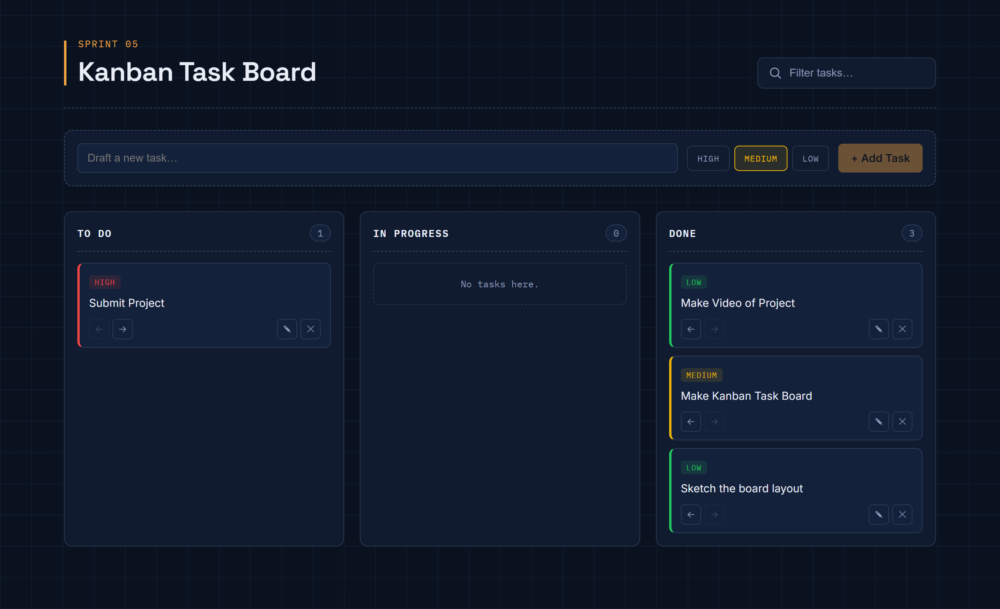

# 📋 Kanban Task Board

A responsive Kanban Task Board built with **React** and **Vite** that helps users organize and manage tasks efficiently. The application allows users to create, edit, move, search, and delete tasks while storing data in the browser using **Local Storage**.

---

## 📸 Screenshot

<p align="center">
  
</p>

---

## ✨ Features

- ➕ Add new tasks
- ✏️ Inline task editing
- 🗑️ Delete tasks
- 🔄 Move tasks between **To Do**, **In Progress**, and **Done**
- 🔍 Search tasks instantly
- 🎯 Assign task priorities (High, Medium, Low)
- 🎨 Color-coded priority badges
- 💾 Persistent data using Local Storage
- 📱 Responsive design

---

## 🛠️ Technologies Used

- React.js
- Vite
- JavaScript (ES6+)
- CSS3
- React Hooks
- Local Storage

---

## 📂 Project Structure

```text
src/
│
├── components/
│   ├── AddTaskForm.jsx
│   ├── SearchBar.jsx
│   ├── Board.jsx
│   ├── Column.jsx
│   └── TaskCard.jsx
│
├── hooks/
│   └── useLocalStorage.js
│
├── utils/
│   └── constants.js
│
├── App.jsx
├── App.css
└── main.jsx
```

---

## 🚀 Getting Started

### Clone the repository

```bash
git clone https://github.com/Akarsh-Coding/kanban-task-board.git
```

### Navigate to the project

```bash
cd kanban-task-board
```

### Install dependencies

```bash
npm install
```

### Start the development server

```bash
npm run dev
```

---

## 📖 How It Works

1. Add a new task with a priority level.
2. Tasks are initially added to the **To Do** column.
3. Move tasks through **In Progress** and **Done**.
4. Edit task details directly from the task card.
5. Delete tasks when they are no longer needed.
6. Search tasks using the search bar.
7. All tasks are automatically saved to Local Storage.

---

## 📌 Key Features

- Component-based architecture
- Custom `useLocalStorage` hook
- Reusable React components
- Instant search functionality
- Responsive layout
- Persistent task storage

---

## 🔮 Future Improvements

- Drag and Drop support
- Due dates
- Task categories
- Dark/Light theme
- Task sorting
- User authentication
- Cloud database integration

---

## 👨‍💻 Author

**Akarsh Kumar**

---

## ⭐ Show Your Support

If you found this project helpful, consider giving it a ⭐ on GitHub!
